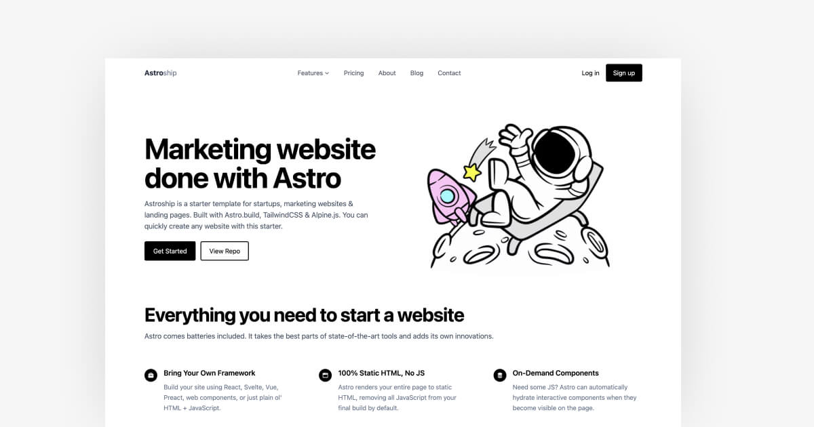

<div align="center">

# CerebraSense

**Deep Learning-based Brain Tumor MRI Classification Web Application**

  

---


</div>

---

## Table of Contents

1. [Overview](#overview)
2. [Tech Stack](#tech-stack)
3. [Pipeline Flow](#pipeline-flow)
4. [Repository Structure](#repository-structure)
5. [Core Features](#core-features)
6. [Screenshots](#screenshots)
7. [Getting Started](#getting-started)
8. [Environment Variables](#environment-variables)
9. [Available Scripts](#available-scripts)
10. [API Reference](#api-reference)
11. [Supabase Schema](#supabase-schema)
12. [Model Artifacts](#model-artifacts)
13. [Future Improvements](#future-improvements)
14. [Contributing](#contributing)
15. [Connect With Me](#connect-with-me)

---

## Overview

CerebraSense is a deep learning model-powered brain tumor MRI classification web application. It allows users to upload MRI images, sends them to a calibrated PyTorch model service for inference, stores the scan and prediction result in Supabase, and displays saved analysis history in a repository page.

The production architecture separates the web interface, model runtime, and storage layer:

- **Vercel** hosts the Astro web application and server API routes.
- **Railway** hosts the FastAPI model service that loads the PyTorch EfficientNet-B0 bundle.
- **Supabase** provides Postgres records plus S3-compatible Storage buckets for uploaded scans and model artifact delivery.

In short: users interact with the Vercel-hosted web app, the app calls the Railway-hosted model service for inference, and Supabase persists both MRI scan files and analysis metadata.

**Primary capabilities:**

- Upload MRI images in PNG or JPG format
- Preview uploaded scans before and after analysis
- Classify scans into glioma, meningioma, no tumor, or pituitary classes
- Display class probabilities, calibrated confidence, model version, and uncertainty status
- Store scan files in Supabase Storage
- Store analysis records in Supabase Postgres
- Render repository records from saved Supabase data
- Provide class-specific educational insights for each prediction type
- Provide updated development documentation for the improved model pipeline

> Important: CerebraSense is a research and educational prototype. It is not a clinical diagnosis tool and should not replace professional medical review.

---

## Tech Stack

### Web Application

| Layer          | Technology           | Version | Purpose                                |
| :------------- | :------------------- | :------ | :------------------------------------- |
| Framework      | Astro                | 5.x     | Web app, pages, server-rendered routes |
| Server Adapter | `@astrojs/vercel`    | 9.x     | Vercel serverless output for API routes |
| Language       | TypeScript           | 5.x     | Frontend and API route logic           |
| Styling        | Tailwind CSS / CSS   | 4.x     | UI styling and responsive layouts      |
| Icons          | astro-icon / Iconify | Latest  | Interface icons                        |

### Deployment

| Layer | Platform | Purpose |
| :---- | :------- | :------ |
| Web App | Vercel | Hosts Astro pages, static assets, and `/api/*` server routes |
| Model API | Railway | Hosts FastAPI, PyTorch, and the EfficientNet-B0 model runtime |
| Database | Supabase | Stores `tumor_analyses` records |
| File Storage | Supabase Storage / S3-compatible bucket | Stores MRI uploads and hosts the deployable model bundle |

### Backend and Storage

| Layer          | Technology              | Purpose                                               |
| :------------- | :---------------------- | :---------------------------------------------------- |
| Database       | Supabase Postgres       | Stores analysis metadata and prediction results       |
| Object Storage | Supabase Storage / S3-compatible buckets | Stores uploaded MRI scans and model artifacts |
| Client SDK     | `@supabase/supabase-js` | Server-side storage and database operations           |
| Security       | RLS Policies            | Controls access to analysis records                   |

### Model Service

| Layer            | Technology           | Purpose                                                   |
| :--------------- | :------------------- | :-------------------------------------------------------- |
| API Framework    | FastAPI              | Serves model inference endpoint                           |
| ASGI Server      | Uvicorn              | Runs the local model service                              |
| ML Framework     | PyTorch              | Loads and runs the EfficientNet-B0 brain tumor classifier |
| Vision Utilities | torchvision / Pillow | EfficientNet support and image preprocessing              |
| Data Utilities   | NumPy / scikit-learn | Numerical utilities and legacy artifact compatibility     |

---

## Pipeline Flow

```txt
Upload MRI Image (PNG / JPG)
         |
         v
Astro Demo Page on Vercel
         |
         v
POST /api/analyze
         |
         |-- Upload original scan to Supabase Storage bucket: brain-scans
         |
         |-- Send image to Railway FastAPI /predict
         v
Railway PyTorch Model Service
         |
         |-- Download model bundle from Supabase model_artifacts bucket if needed
         |-- Preprocess image as 224 x 224 RGB tensor
         |-- Run EfficientNet-B0 inference
         |-- Apply temperature calibration
         |-- Return predicted label + probabilities + uncertainty status
         v
Astro API Route
         |
         |-- Insert core result into tumor_analyses
         |-- Return saved record with model response metadata
         v
Analysis Result Modal
         |
         v
Repository Page
Reads saved records from Supabase
```

### Deployment Architecture

```txt
Browser
  |
  v
Vercel: Astro Web App
  |-- serves UI pages: /, /demo, /repository, /resources
  |-- runs server routes: /api/analyze and /api/analyses
  |
  |-- stores MRI file --------------------------.
  |                                             v
  |                                  Supabase Storage
  |                                  - brain-scans bucket
  |                                  - model_artifacts bucket
  |
  |-- calls model inference --------------------.
                                                v
                                      Railway: FastAPI Service
                                      - PyTorch EfficientNet-B0
                                      - cerebrasense_improved_bundle.pt
                                      - /health
                                      - /predict

Supabase Postgres
  - tumor_analyses table
  - prediction metadata
  - probabilities JSON
```

---

## Repository Structure

```txt
cerebrasense-web/
|-- astro.config.mjs              # Astro server configuration
|-- package.json                  # Node dependencies and scripts
|-- tsconfig.json                 # TypeScript config and path aliases
|-- README.md                     # Project documentation
|-- .env                          # Local environment variables (ignored)
|-- .gitignore                    # Git ignore rules
|
|-- public/
|   |-- logo.svg                 # Browser tab icon and README logo
|   |-- logo.png                 # Source logo image
|   |-- opengraph.jpg
|   |-- profile.png
|   `-- samples/
|
|-- src/
|   |-- components/
|   |   |-- repository.astro      # Supabase-backed repository UI
|   |   `-- docs.astro            # /development documentation content
|   |
|   |-- layouts/
|   |   `-- Layout.astro
|   |
|   |-- lib/
|   |   `-- supabase/
|   |       |-- client.ts         # Browser Supabase client
|   |       `-- server.ts         # Server/admin Supabase client
|   |
|   |-- pages/
|   |   |-- api/
|   |   |   |-- analyze.ts        # Upload, infer, save analysis
|   |   |   `-- analyses.ts       # List saved analyses
|   |   |-- demo.astro            # MRI upload and analysis page
|   |   |-- development.astro     # Improved model development docs
|   |   |-- repository.astro      # Saved analysis records
|   |   |-- resources.astro       # Setup and stack notes
|   |   `-- types/
|   |       `-- analysis.ts       # Shared analysis types
|   |
|   `-- styles/
|       `-- global.css
|
|-- model-service/
|   |-- requirements.txt          # Python dependencies
|   |-- app/
|   |   |-- main.py               # FastAPI app and /predict endpoint
|   |   |-- model.py              # EfficientNet bundle loading
|   |   |-- preprocess.py         # 224 x 224 RGB preprocessing
|   |   `-- schemas.py            # Response schemas
|   |
|   `-- models/
|       `-- local model artifacts # Ignored by Git
|
`-- supabase/
    `-- schema.sql                # Table, bucket, and RLS setup
```

---

## Core Features

### MRI Upload and Preview

- Drag-and-drop or click-to-browse upload zone
- Supports JPEG and PNG MRI files
- Shows uploaded filename before analysis
- Shows image preview inside the analysis result modal
- Prevents duplicate actions while analysis is running

### AI-Powered Tumor Classification

- FastAPI receives uploaded MRI images
- PyTorch model returns:
  - predicted class
  - display label
  - calibrated confidence score
  - class probability distribution
  - model version
  - uncertainty status
  - confidence threshold
- Supported classes:
  - **Glioma**
  - **Meningioma**
  - **No Tumor**
  - **Pituitary**

### Improved Model Pipeline

- EfficientNet-B0 transfer-learning classifier
- 224 x 224 RGB input preprocessing
- ImageNet normalization
- Temperature-scaled confidence calibration
- 70% confidence threshold for uncertain predictions
- Deployment bundle keeps weights, class order, preprocessing config, temperature, and threshold together

### Supabase Persistence

- Original uploaded MRI image is saved to Supabase Storage
- Core analysis metadata is saved to Supabase Postgres
- Repository page reads saved records from Supabase
- Private bucket access uses signed image URLs

### Repository and Insights

- Saved analysis cards are generated from Supabase records
- Filtering by prediction class
- Detail modal with confidence bars
- Class-specific educational insight content for glioma, meningioma, pituitary, and no tumor results
- Label normalization prevents `No Tumor`, `notumor`, and `no_tumor` from routing to the wrong insight content

### Development Documentation

The `/development` route documents the improved training pipeline, final metrics, calibration, deployment artifacts, and web integration changes.

### Health Endpoint

The model service exposes:

```txt
GET /health
```

This confirms the FastAPI service, deployed model version, active architecture, input size, and confidence threshold are available.

---

## Screenshots

<div align="center">
  <table border="0" cellpadding="12" cellspacing="0" style="border-collapse: collapse; width: 100%; table-layout: fixed;">
    <tr>
      <td align="center" width="50%">
        <strong>1. Upload Interface</strong><br>
        <br>
        <sub>MRI upload page with drag-and-drop support and analysis action.</sub>
      </td>
      <td align="center" width="50%">
        <strong>2. Analysis Result</strong><br>
        <br>
        <sub>Prediction modal with uploaded image preview, calibrated class probabilities, and uncertainty notice when needed.</sub>
      </td>
    </tr>
    <tr>
      <td align="center" width="50%">
        <strong>3. Repository</strong><br>
        <br>
        <sub>Saved Supabase analysis records with class filtering.</sub>
      </td>
      <td align="center" width="50%">
        <strong>4. Development Docs</strong><br>
        <br>
        <sub>Improved model pipeline, evaluation metrics, and deployment notes.</sub>
      </td>
    </tr>
  </table>
</div>

> Replace these placeholder images with screenshots under `public/img/screenshots/` when final screenshots are available.

---

## Getting Started

### Prerequisites

- Node.js 18 or later
- npm
- Python 3.10 or later
- pip
- Supabase project
- Local model artifact files

### Installation

```bash
# Clone the repository
git clone https://github.com/Juaaanits/Cerebrasense-Web.git
cd Cerebrasense-Web

# Install web dependencies
npm install

# Install model-service dependencies
cd model-service
pip install -r requirements.txt
cd ..
```

### Supabase Setup

Run the SQL file in your Supabase SQL Editor:

```txt
supabase/schema.sql
```

This creates:

- `tumor_analyses` table
- Row Level Security setup
- `brain-scans` private Storage bucket
- `model_artifacts` bucket for the deployed model bundle

### Model Artifacts

Place the active model bundle inside:

```txt
model-service/models/cerebrasense_improved_bundle.pt
```

The active model service loads the filename expected by `model-service/app/model.py`. Restart the FastAPI service after replacing or updating model files.

For Railway deployment, the service can also download the model bundle from Supabase Storage using:

```env
MODEL_BUNDLE_URL=https://your-project.supabase.co/storage/v1/object/public/model_artifacts/cerebrasense_improved_bundle.pt
```

This avoids relying on Git LFS during container builds.

### Run Locally

Open two terminals.

```bash
# Terminal 1: FastAPI model service
cd model-service
uvicorn app.main:app --reload --port 8000
```

```bash
# Terminal 2: Astro web app
npm run dev
```

Open:

```txt
http://localhost:4321/demo
```

---

## Environment Variables

Create a `.env` or `.env.local` file in the project root:

| Variable                          | Required | Description                                                        |
| :-------------------------------- | :------- | :----------------------------------------------------------------- |
| `PUBLIC_SUPABASE_URL`             | Yes      | Supabase project URL                                               |
| `PUBLIC_SUPABASE_PUBLISHABLE_KEY` | Yes      | Browser-safe Supabase publishable key                              |
| `SUPABASE_SECRET_KEY`             | Yes      | Server-side Supabase secret or service role key                    |
| `MODEL_API_URL`                   | Yes      | FastAPI model service URL                                          |
| `MODEL_API_TOKEN`                 | No       | Optional shared token if model-service auth enforcement is enabled |
| `MODEL_BUNDLE_URL`                | Railway  | Direct Supabase Storage URL for `cerebrasense_improved_bundle.pt`  |

```dotenv
# Supabase
PUBLIC_SUPABASE_URL=https://your-project.supabase.co
PUBLIC_SUPABASE_PUBLISHABLE_KEY=your-publishable-key
SUPABASE_SECRET_KEY=your-server-secret-key

# Model service
MODEL_API_URL=http://127.0.0.1:8000
MODEL_API_TOKEN=dev-secret-token

# Railway model bundle download
MODEL_BUNDLE_URL=https://your-project.supabase.co/storage/v1/object/public/model_artifacts/cerebrasense_improved_bundle.pt
```

Never commit real environment values.

Production environment placement:

| Platform | Variables |
| :------- | :-------- |
| Vercel | `PUBLIC_SUPABASE_URL`, `PUBLIC_SUPABASE_PUBLISHABLE_KEY`, `SUPABASE_SECRET_KEY`, `MODEL_API_URL`, `MODEL_API_TOKEN` |
| Railway | `MODEL_BUNDLE_URL`, `MODEL_API_TOKEN` if token enforcement is enabled |

---

## Available Scripts

| Command                                     | Description                                       |
| :------------------------------------------ | :------------------------------------------------ |
| `npm run dev`                               | Start Astro development server on port 4321       |
| `npm run build`                             | Build the Astro server app                        |
| `npm run preview`                           | Preview the production build                      |
| `npm run astro`                             | Run Astro CLI commands                            |
| `uvicorn app.main:app --reload --port 8000` | Start FastAPI model service from `model-service/` |
| `pip install -r requirements.txt`           | Install model-service Python dependencies         |

---

## API Reference

### `POST /api/analyze`

Accepts an MRI image upload, stores the image, runs model inference, saves the core analysis record, and returns the saved result with the latest model response metadata.

**Request:**

```txt
Content-Type: multipart/form-data
Body: scan=<file>
```

**Response:**

```json
{
  "analysis": {
    "id": "uuid",
    "created_at": "2026-05-16T00:00:00.000Z",
    "image_path": "anonymous/uuid.jpg",
    "original_filename": "Te-gl_0010.jpg",
    "predicted_label": "glioma",
    "display_label": "Glioma",
    "confidence": 99.58,
    "probabilities": {
      "glioma": 99.58,
      "meningioma": 0.03,
      "notumor": 0.12,
      "pituitary": 0.27
    },
    "model_version": "efficientnet-b0-transfer-calibrated-v1",
    "is_uncertain": false,
    "confidence_threshold": 70.0,
    "status": "completed"
  }
}
```

### `GET /api/analyses`

Returns saved analysis records from Supabase with signed image URLs.

**Response:**

```json
{
  "analyses": [
    {
      "id": "uuid",
      "original_filename": "Te-no_0012.jpg",
      "predicted_label": "notumor",
      "confidence": 90.4,
      "probabilities": {
        "glioma": 2.7,
        "meningioma": 3.3,
        "notumor": 90.4,
        "pituitary": 3.5
      },
      "model_version": "efficientnet-b0-transfer-calibrated-v1",
      "image_url": "https://signed-supabase-url"
    }
  ]
}
```

### `GET /health`

FastAPI model-service health check.

**Response:**

```json
{
  "status": "ok",
  "model_version": "efficientnet-b0-transfer-calibrated-v1",
  "model_name": "efficientnet_b0",
  "image_size": 224,
  "confidence_threshold": 0.7
}
```

### `POST /predict`

FastAPI prediction endpoint used internally by the Astro API route.

**Request:**

```txt
Content-Type: multipart/form-data
Body: file=<image>
```

**Response:**

```json
{
  "predicted_label": "glioma",
  "display_label": "Glioma",
  "confidence": 99.58,
  "probabilities": {
    "glioma": 99.58,
    "meningioma": 0.03,
    "notumor": 0.12,
    "pituitary": 0.27
  },
  "model_version": "efficientnet-b0-transfer-calibrated-v1",
  "is_uncertain": false,
  "confidence_threshold": 70.0
}
```

---

## Supabase Schema

Main table:

```sql
public.tumor_analyses
```

Key fields:

| Column              | Purpose                               |
| :------------------ | :------------------------------------ |
| `id`                | Analysis record UUID                  |
| `created_at`        | Timestamp of analysis                 |
| `user_id`           | Optional Supabase Auth user reference |
| `image_path`        | Path in the `brain-scans` bucket      |
| `original_filename` | Uploaded filename                     |
| `predicted_label`   | Model prediction                      |
| `confidence`        | Confidence percentage                 |
| `probabilities`     | JSON object of class probabilities    |
| `model_version`     | Deployed model version                |
| `status`            | Analysis status                       |
| `error_message`     | Optional failure message              |

Storage buckets:

```txt
brain-scans
model_artifacts
```

The `brain-scans` bucket stores uploaded MRI files and is treated as private. The repository page uses signed URLs to display saved MRI previews.

The `model_artifacts` bucket stores the production model bundle used by Railway. The deployed model service downloads `cerebrasense_improved_bundle.pt` from this bucket when the file is missing or when the Git checkout contains only a Git LFS pointer.

> Note: `display_label`, `is_uncertain`, and `confidence_threshold` are returned immediately by `/api/analyze` from the model response. The current database schema persists the core prediction fields listed above.

---

## Model Artifacts

Model artifacts are intentionally ignored by Git.

Expected local path:

```txt
model-service/models/
```

Active artifact set:

```txt
model-service/models/cerebrasense_improved_bundle.pt
model-service/models/preprocess_config.json
```

The bundle contains:

- EfficientNet-B0 model weights
- class order
- display labels
- input size
- ImageNet normalization settings
- learned temperature value
- confidence threshold
- training configuration metadata

Current deployed model:

| Field                       | Value                                    |
| :-------------------------- | :--------------------------------------- |
| Model version               | `efficientnet-b0-transfer-calibrated-v1` |
| Architecture                | EfficientNet-B0                          |
| Input size                  | 224 x 224                                |
| Test accuracy               | 98.93%                                   |
| Test macro F1               | 98.89%                                   |
| Temperature                 | 0.6293                                   |
| Confidence threshold        | 70%                                      |
| Accepted-only test accuracy | 99.08%                                   |

Previous local artifacts may still exist for reference:

```txt
model-service/models/cnn_model1.pt
model-service/models/scaler.pkl1
model-service/models/metadata.pkl1
```

Do not commit `.pt`, `.pkl`, `.pkl1`, or local model `.json` files unless the project intentionally moves to Git LFS or external model hosting.

Current deployment uses Supabase Storage for model delivery:

```txt
Supabase Storage bucket: model_artifacts
Railway env var: MODEL_BUNDLE_URL
Railway runtime path: /app/models/cerebrasense_improved_bundle.pt
```

The Railway service downloads the bundle during startup if needed, then loads it with PyTorch.

---

## Future Improvements

### Version 2 - Product Hardening

| Priority | Feature                      | Description                                               |
| :------- | :--------------------------- | :-------------------------------------------------------- |
| High     | Supabase Auth                | Associate analysis records with authenticated users       |
| High     | Role-based Access            | Restrict repository records per user or organization      |
| High     | Model Artifact Hosting       | Store model artifacts in a controlled release location    |
| Medium   | Upload Validation            | Add file size, image dimension, and corrupt-image checks  |
| Medium   | Persist Uncertainty Metadata | Store `is_uncertain` and threshold values in Postgres     |
| Medium   | Signed Preview Refresh       | Refresh expired signed URLs client-side                   |
| Medium   | Repository Search            | Search records by filename, class, model version, or date |
| Low      | Export Records               | Download analysis history as CSV or JSON                  |

### Version 3 - Clinical Research Improvements

- External validation on independent MRI datasets
- Patient-level dataset splitting where identifiers are available
- Tumor localization or heatmap visualization
- Human review workflow for uncertain predictions
- Audit log for model version, preprocessing config, and result changes
- Broader MRI sequence and acquisition testing before clinical-facing use

---

## Contributing

Contributions are welcome for educational and research improvements.

### How to Contribute

```bash
# 1. Fork the repository
# 2. Create a feature branch
git checkout -b feature/your-feature-name

# 3. Make your changes and commit
git commit -m "feat: describe your change"

# 4. Push to your fork
git push origin feature/your-feature-name

# 5. Open a Pull Request against main
```

### Guidelines

- Keep pull requests focused
- Do not commit `.env` files or model artifacts
- Run `npm run build` before submitting web changes
- Test the FastAPI service locally for model changes
- Keep medical wording cautious and educational

---

## Connect With Me

<div align="center">

  <a href="https://juanito-portfolio-website.vercel.app/">
    
  </a>
  <a href="https://www.linkedin.com/in/juanitoramos/">
    
  </a>
  <a href="https://github.com/Juaaanits">
    
  </a>
  <a href="mailto:juanitoramos113@gmail.com">
    
  </a>

<br><br>

Star this repository if you find it helpful.

Built by [Juanito M. Ramos II](https://github.com/Juaaanits)

_Last Updated: May 2026_

</div>
